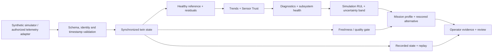

# TwinGuard Aero — evidence and validation roadmap

Prepared on 26 September 2026 for SIH26054. This is a source-based implementation inventory and a proposed validation plan. It is not a fresh test-run report.

## Scope and official alignment

The official SIH listing identifies PS54 as a DRDO software challenge in Robotics and Drones for aero-piston engine digital twins. It asks for synchronized engine state, health monitoring, predictive analysis, simulation/replay and an operator interface. It accepts a demonstration with simulated or real datasets and requests architecture, software, models, documentation and a deployment path. [Official PS listing](https://sih.gov.in/sih2026PS)

The table below maps those areas to the repository. “Implemented” means the named source exists and was inspected; it does not imply hardware validation or a passing release test.

| Area | Current implementation evidence | Boundary / next evidence |
|---|---|---|
| Synchronized state and ingestion | `backend/app/main.py`, `schemas.py`, `services/twin_manager.py`; HTTP and WebSocket paths | Single configured engine/process; demonstrate live arrival, rejected invalid samples and recovery |
| Healthy-reference comparison | `services/physics.py`; explicit model identity and nine residual channels | Generic surrogate; replace or calibrate using authorized engine maps |
| Engine condition and sensor quality | `services/health.py`, `sensor_trust.py`; separate subsystem and sensor assessments | Verify against independent physical and sensor fault labels |
| Diagnostic and prognostic module | `services/ai_engine.py`, `ai/train_models.py`, `models/MODEL_CARD.md` | Default engineering fallback; optional synthetic ML; RUL targets and bands are not field-calibrated |
| Environmental/profile analysis | `services/mission.py`, `frontend/src/components/MissionDeck.tsx` | Explicit prototype profile weights; compare controlled scenarios, then calibrate with rig evidence |
| Evaluator evidence workflow | `frontend/src/components/EvaluationDeck.tsx`; healthy baseline, controlled hosted faults, comparison and checksum export | Session state survives view changes until reload; SHA-256 verifies payload integrity, not source authenticity |
| Recorded mission inspection | `services/replay.py`, `ReplayDeck.tsx`; `scripts/evaluate_recording.py` | Offline tool needs supplied reference labels; no automatic inference of ground truth |
| Operator workflow | `CommandCenter`, `DigitalTwinDeck`, `DiagnosticsDeck`, `HealthFaultsDeck`, `MaintenanceDeck` | Verify readable units, keyboard navigation, mobile layout and failure states in the released build |
| Engine integration | `integrations/can/`, `backend/app/integrations/can_bridge.py`, `mqtt_consumer.py` | Adapter pathway, not a completed real-engine integration; authorized DBC and timing checks required |
| Deployment and trust | `docs/operations/production.md`, `services/operations.py`, authentication and backup utilities | Demonstrate local persistence/recovery; controlled network/security review before operational deployment |

## Architecture to show on a technical slide

The hosted browser demonstration uses a separate synthetic runtime. Do not draw a public Vercel site as if it were directly connected to an operational engine. The local stack demonstrates the backend path above.

## Suggested comparison experiment

Use the same held-out recording, fault definitions and alert-persistence policy for all approaches:

| Baseline or variation | Question answered |
|---|---|
| Fixed engineering thresholds | What does conventional independent-channel monitoring detect? |
| Operating-context residuals | Does expected-versus-observed comparison reduce errors across load/environment changes? |
| Residuals + temporal evidence | Does persistence improve useful warnings without hiding developing faults? |
| Full prototype including Sensor Trust | Does separating measurement inconsistency improve diagnosis of sensor and physical faults? |

Split by complete run, operating condition and ultimately engine rather than randomly mixing adjacent samples between train and test sets. Lock the test data before tuning. Keep normal transients and sensor faults in the evaluation, not only obvious high-severity failures. Record the simulator/model relationship so synthetic independence is not overstated.

## Validation gates

| Stage | Work and evidence to produce | Exit condition |
|---|---|---|
| 1. Reproducible software release | Commit identifier, dependency locks, backend checks, frontend build, browser checks, fault-matrix report and deployment smoke results | All required checks pass on the exact released revision; failures and exceptions are documented |
| 2. Independent recording evaluation | Data permission, signal dictionary, units, timestamps, source hash, independent labels and baseline comparison | Input integrity established; results reproducible with dataset scope stated |
| 3. Read-only rig integration | Authorized DBC/ECU mapping, clock synchronization, sampling/loss observations and recorded transients | Every channel checked against the source instrument; no flight-control authority assigned |
| 4. Engine-specific calibration | Healthy maps and transient response across the approved load/environment envelope | Held-out residual behavior and known limitations reviewed by propulsion engineers |
| 5. Diagnostic validation | Fault-specific recall/precision, false alarms per operating hour, missed detections and warning lead time | Acceptance targets agreed with the partner before final test; failure cases retained |
| 6. Prognostic validation | Degradation/maintenance ground truth, RUL error, uncertainty coverage and out-of-distribution tests | Justified RUL scope and calibrated uncertainty; unsupported conditions visibly withheld |
| 7. Deployment and assurance | Measured latency, memory, CPU, recovery, backup restore, permissions, threat model and domain-led review | Intended environment and responsibilities agreed; remaining operational approval work explicit |

These are proposed milestones, not official SIH numerical thresholds. Set numerical targets with the target-engine/test-rig partner. Current tests cannot establish flight safety, a reliability percentage, cost savings or fleet-scale capacity.

## What to record when publishing a metric

- Code revision and clean/modified working-tree state.
- Dataset source, permission, hash, units, sample count and independent label provenance.
- Train/validation/test split and leakage controls.
- Active model mode, model manifest and feature/label contract.
- Hardware, software versions, test command and time.
- Metric definition, denominator, distribution/uncertainty and failure cases.
- Whether the result is a software check, synthetic experiment, rig experiment or field observation.

Useful diagnostic outcomes include **false alarms per operating hour**, **fault-specific precision/recall**, **time from labeled onset to stable alert**, and **time from stable alert to the reference event**, when those events exist. RUL error requires appropriate RUL ground truth; no prediction can act as its own reference label. For deployment performance, record p50/p95 latency with measured load and CPU/memory use rather than promising real-time capability from an unmeasured refresh animation.

## Claims register

| Suitable wording now | Evidence required before stronger wording |
|---|---|
| “Working synthetic digital-twin demonstrator” | Current end-to-end verification of the release |
| “Generic operating-condition-aware healthy reference” | Engine-specific maps before “calibrated engine model” |
| “Simulation-derived RUL and prototype uncertainty band” | Longitudinal ground truth and coverage calibration before “validated RUL” |
| “Mission feasibility index for engineering comparison” | Operational-outcome calibration before any mission-success probability |
| “Configurable CAN adapter” | Tested authorized ECU/DBC integration before engine-compatibility claims |
| “Modular single-engine implementation” | Multi-engine isolation and load/recovery testing before fleet-scale claims |
| “Prototype security controls” | Threat model, independent testing and deployment approval before defence-grade claims |
| “Intended reduction in maintenance uncertainty” | Partner measurements before quantified savings or avoided failures |

## Six-slide official-template mapping

The official SIH2026 template was downloaded and byte-verified. Its six-slide cap includes the title; the instruction slide may be removed. `TwinGuard-Aero-SIH2026-Template-Draft` preserves the supplied section structure and branding.

1. **Title:** PS identity, theme, software category and MINDMESH from existing PS54 material. The team ID remains explicitly unconfirmed.
2. **Idea / proposed solution:** explain the synchronized twin, the operator problem and the connection between trust, condition and mission review.
3. **Technical approach:** languages/frameworks, telemetry-to-review flow, hosted/local distinction and data gate.
4. **Feasibility and viability:** current implementation, unavailable real-engine labels and the staged validation strategy.
5. **Impact and benefits:** operator, propulsion-engineer and maintenance workflows; intended benefits clearly separated from measured outcomes.
6. **Research and references:** official PS, NIST digital-twin resources, model-method references and the project repository.

The PDF still requires the registered Team ID before submission. Preserve the official template and verify team identity against the portal. The separate evaluator brief remains a companion document, not the template-based upload.
